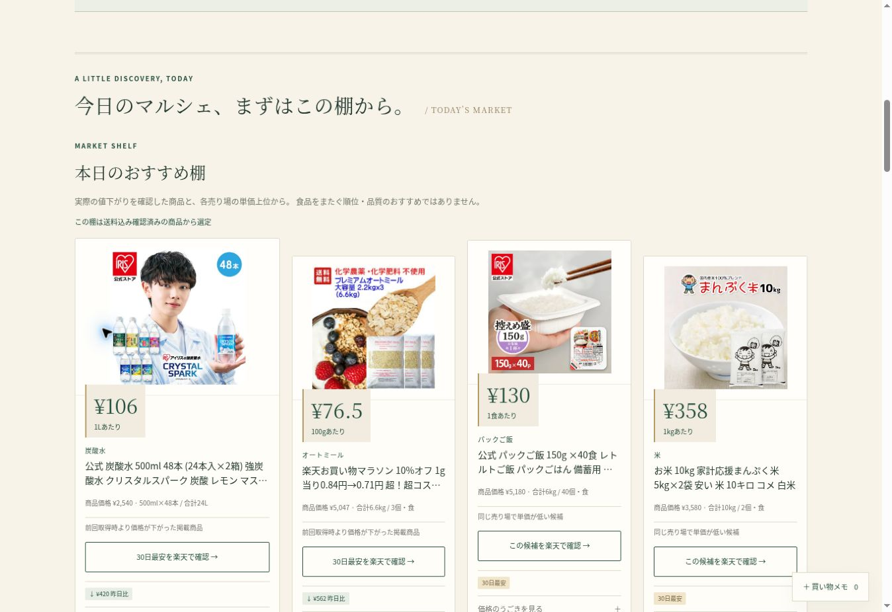
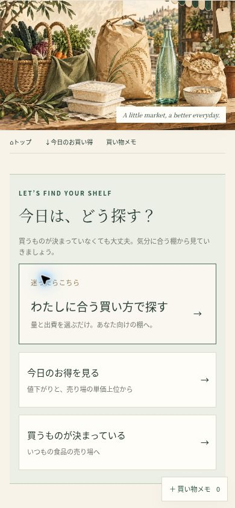

# 最終マルシェ調整（2026-10-02）

## 監査と設計

- 標準API画像は mediumImageUrls（128px）、smallImageUrls（64px）。APIレスポンスに高解像度専用フィールドはない。既存トップの640px指定はTop3へ適用されていなかった。
- Hero → 3入口 → 詳細買い方の2操作を、Hero → 詳細買い方の1操作へ短縮。
- advisorを主入口へ。deal / knownはショートカットとして保持。cheap / large / small / budget / storage / knownの内部ロジックとイベント名は保持。
- 静的3棚の12枠中4枠が重複していた。今日の棚を先に確定し、以降は同じ適格条件の候補から未掲載の商品を優先。候補不足時のみ再掲載。Finderにはこの除外を適用しない。
- 発見カードは写真 → 値札 → 商品名 → 価格・量 → 根拠 → CTA。送料の共通説明は棚単位へ。履歴・保存・比較はCTAの後の補助領域へ移動。

## 画像方針

公式仕様: https://webservice.rakuten.co.jp/documentation/ichiba-item-search

公式APIは128pxまでを返す。640pxを公式API保証とは扱わない。実データの既存thumbnail.image.rakuten.co.jp URLに既にある `_ex` サイズ指定のみを変更し、画像パス・他パラメータを保持する。別ホスト・サイズ指定のないURLは変更しない。読み込み失敗時は元API画像へ一度だけ戻す。

公開前の静的棚・Top3候補17画像をHTTPで取得検証: エラー0、実寸400×400 / 431×423 / 640×640。合計約1.40MB。元画像の解像度より大きくなるとは主張しない。

表示: PC標準188px、今日の先頭208px。スマホ標準180px、先頭200px。Top3 PC最大160px、スマホ最大125px。4位以下は76pxを保持。幅・高さを明記してCLSを防ぐ。

## 計測

既存イベント名を保持。hero_primary_ctaに entry_route=advisor / destination=shopping-intent、entry_route_selectに entry_source=heroを追加。入口ボタンは entry_source=entry。GA4管理画面での実受信は別確認。

## 検証

Python 59件、jsdom 8件。既存の保存互換性、同カテゴリ比較、送料条件、数量計算、7日/30日、CTA variantを確認。画像フォールバック、Heroの直接advisor遷移、静的重複回避と候補不足時の挙動を追加検証。

公開後にPC / 390×844pxで操作確認。主入口はスマホ134px、ショートカットは92px。Heroから直接4つの買い方へ進む。全4売り場Top3は各3商品。スマホのTop3画像は実寸640pxを確認、4位以下の76px画像・少量フィルターを維持。保存・同カテゴリ2商品比較・30日切替・楽天商品ページ遷移を実際に確認し、確認用のメモ・比較を解除した。

PC案内画像のHTML高さ512pxが残っていたためheight:autoを指定。Finder導入部は512px → 約119pxへ縮まり、入口がすぐ見える。

最新スナップショット 2026-10-02 19:53 JST: 129商品。カテゴリ適合・数量再解析・単価再計算・実質重複の監査は問題0。静的棚12枠 / 12商品、棚間重複0。22ページcanonical、JSON-LD 58個を検証。最新候補16画像はHTTP取得エラー0、実寸400〜640px、計約1.35MB。

GA4の既存21イベント名は削除0。指定10イベントの送信をjsdomで確認、Heroイベントと入口イベントでadvisor / heroを識別。

Actions: [本実装の検証](https://github.com/stusaurus/food-cost-jp/actions/runs/36997485088)、[最終ビルド](https://github.com/stusaurus/food-cost-jp/actions/runs/36997956549)、[Pages公開](https://github.com/stusaurus/food-cost-jp/actions/runs/36997996521) 成功。Pagesの新旧公開競合制御は保持。

公開 https://stusaurus.github.io/food-cost-jp/ で最終確認。390px表示はChrome内のiframeで確認しており、実機Safari・GA4管理画面の実受信は未確認。

確認用noindexページは検証完了後に削除。
